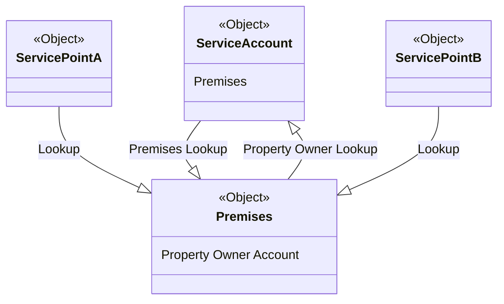

# Actionable Relationship Center - Service Account

According to the [help docs](https://help.salesforce.com/s/articleView?id=sf.fsc_admin_arc_overview.htm&type=5) provides an easy to navigate graph. To get orientated start by looking at the [Trailhead for Actionable Relationship Center](https://trailhead.salesforce.com/content/learn/modules/actionable-relationship-center-in-financial-services-cloud/get-started-with-actionable-relationship-center). While ARC originates from Financial Services Cloud it is available as part of Energy & Utilities Cloud currently.

> A working knowledge of the [Energy & Utilities data model](https://help.salesforce.com/s/articleView?id=ind.energy_energyutilities_cloud_data_model_351148.htm&type=5) will be very helpful for this article.
{: .prompt-info}

## Why should I care about ARC?

With a few simple configurations a lot of functionality can be added to Service Account.

- Add a trigger to create required data structure
- Add Premises Object
- Add Service Point Object

## Express - Agent Console

A sample graph is provided with the [Contact Center Console](https://help.salesforce.com/s/articleView?id=ind.energy_t_energyutilities_contactcenter_console_application_overview_283294.htm&type=5). This graph includes a single level of hierarchy on account object. It does not navigate through Premises or Service Point. The fact that the package data model relies heavily on a hierarchy makes it an excellent candidate for a relationship graph. It would be more powerful it is extended to Premises and Service Point as well.

### Service Account Data Model

The issue with the Energy & Utilities data model is that the Account object has a lookup relationship to the Premises object. 



ARC cannot model this. There is also a field that references Account from the Premises object called Property Owner Account. For a deployment a custom field may be a better option to use but we will use this field as it exists already and is not commonly used.

### Trigger

The plan of attack here is to create a trigger that will populate the Property Owner Account on Premises when a Service Account is created that points to the Premises. The seuqnce here is important as Premises is created before Service Account as Service Account has a lookup to Premises.

This relationship matters as it used it several console Flex Card components as well as some Multi Site CPQ logic. The goal here is have the data model be used as normal but use the trigger to add this lookup to account in order to allow Premises to be configured in ARC.

> Note that this trigger can very likely be improved. The trigger itself is not the point of the excercise, it is more about the data pattern required for ARC to work in this scenario.
{: .prompt-info}

```javascript
trigger UpdatePremises on Account (after insert, after update) {
    // Map to hold record type names and their corresponding ids
    Map<String, Id> recordTypeMap = new Map<String, Id>();
    
    // Query for all Record Types and populate the map
    for(RecordType rt : [SELECT Id, Name FROM RecordType WHERE SObjectType = 'Account']) {
        recordTypeMap.put(rt.Name, rt.Id);
    }
    
    // Check if 'Service Account' record type exists in the map
    if(recordTypeMap.containsKey('Service')) {
        Id serviceAccountRecordTypeId = recordTypeMap.get('Service');
        
        // List to hold Premises records to be updated
        List<vlocity_cmt__Premises__c> premisesToUpdate = new List<vlocity_cmt__Premises__c >();
        
        // Iterate over the Trigger.new list to process new or updated Account records
        for(Account acc : Trigger.new) {
            // Check if the Account record type is 'Service Account'
            if(acc.RecordTypeId == serviceAccountRecordTypeId) {
                // Query for the related Premises records
                List<vlocity_cmt__Premises__c> relatedPremises = [SELECT Id, vlocity_cmt__PropertyOwnerAccountId__c
                                                     FROM vlocity_cmt__Premises__c 
                                                     WHERE Id = :acc.vlocity_cmt__PremisesId__c ];
                
                // Update the related Premises records
                for(vlocity_cmt__Premises__c  prem : relatedPremises) {
                    prem.vlocity_cmt__PropertyOwnerAccountId__c = acc.Id;
                    premisesToUpdate.add(prem);
                }
            }
        }
        
        // Update the Premises records
        if(!premisesToUpdate.isEmpty()) {
            update premisesToUpdate;
        }
    } else {
        System.debug('Record type "Service" not found.');
    }
}


```
{: file="UpdatePremises.apxt" }

After creating this trigger. Test that is works by changing any Service Account record that has an associated Premises (for example, Corner Cafe in the trial org).

### Premises Object

Now then, let's start to extent the default graph shipped in Express Orgs. 

> Note that you could create a new one we are just saving some clicks by extending wehat we have
{: .prompt-info}

Navigate to `Setup > Actionable Relationship Center > sfiEnergyConsoleInteractionGraph`{: .filepath} and select 'edit' from the inline dropdown menu.

{: w="700" h="400" }
_ARC Express Graph_

On Service Accounts node click the + sign. For Object, type in Premises and for Parent Node Lookup Field select 'Property Owner Account'. Leave the rest of the settings as default.

{: w="700" h="400" }
_ARC Adding Premises Object_

Select the fields to show on the Display tab of the Premises object (in this case, Name and Premises Identifier).

### Service Point Object

Next let's add service point. Click on the + sign below the Premises object. Type in 'Service Point' for the Object and select 'Premises' as the Parent Node Lookup Field.

{: w="700" h="400" }
_ARC Adding Service Point Object_

Select the fields to show on the Display tab of the Service Point object (in this case, Market Identifier and Service Type).

Preview the updated graph by navigating to the Corner Cafe account record in the 'Energy Utility Console' app.

{: w="700" h="400" }
_ARC Adding Service Point Object_

### Wrap up

Note that a custom field could be used for the lookup from Premises to Account is Propert Owner Account is being used already. In general it is more likely that Account Contact Relationship or Account Relationship would be used to cover scenarios where Property Owner Account would be used.

Later posts will add objects to other records (e.g. Billing Account payment methods), add actions to objects (e.g. meter read from service point) and Flex Cards... To view Actionable Relationship Center posts filter by sub category 'ARC'.